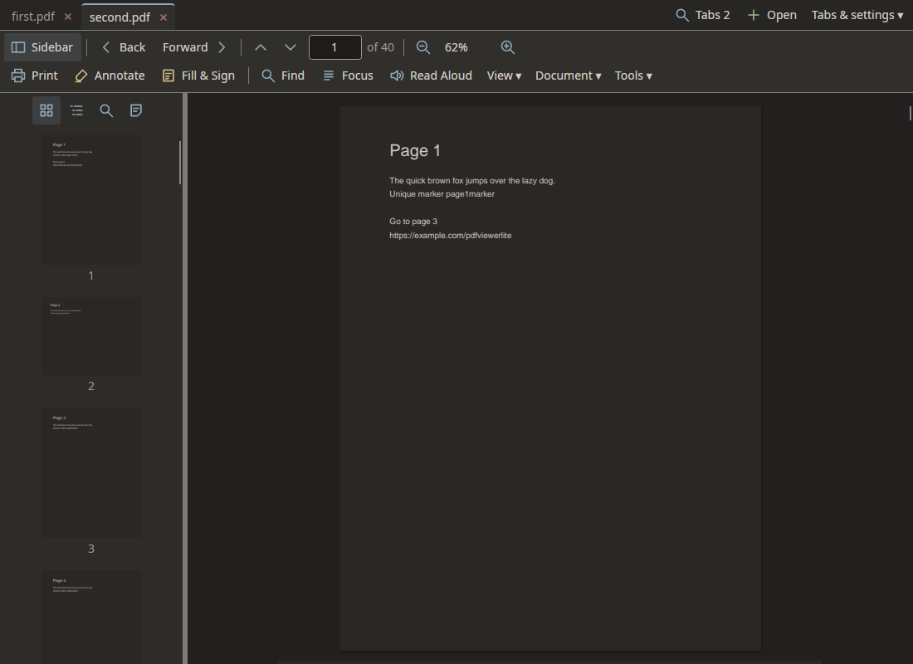
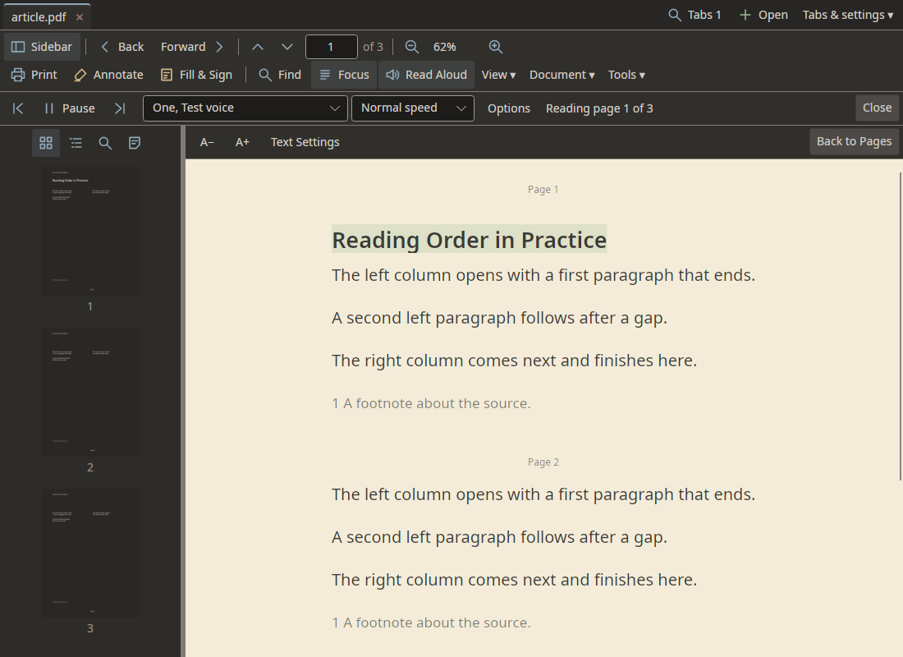
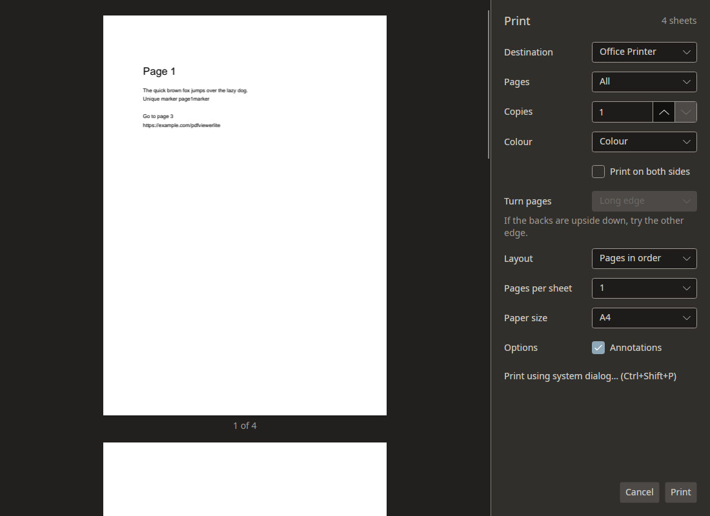

# Hyper PDF Viewer

A PDF viewer for Linux, Windows and macOS. Read, search, annotate, fill forms, sign and print in one tabbed window. Documents stay on your computer unless you choose an online service.



## Get started

Download a package from [GitHub releases](https://github.com/glennawatson/PdfViewerLite/releases). Packages support Linux AppImage, deb, rpm and AUR, Windows installers and portable archives, and macOS app bundles and disk images.

1. Choose **Open**, or drop a PDF onto the window.
2. Use the page box, thumbnails or bookmarks to move through it.
3. Choose **Find** to search or **Focus** for adjustable reading text.
4. Open **Tabs & settings → Preferences** for appearance and startup settings.

## Features

| Task | Options |
|---|---|
| Manage documents | Reorder tabs, find tabs, hover previews, restore the session and reopen closed tabs. Open files, password-protected PDFs and web URLs. |
| Navigate | Thumbnails, bookmarks, page labels, links and back/forward history. |
| View | Continuous, page-by-page, two-page and cover layouts. Rotate, fit page, fit width or set zoom. Ctrl+wheel zooms around the pointer. |
| Find text | Match case or whole words. Search one PDF or every PDF in a folder. |
| Read | Select and copy text. Use caret browsing, Read Mode or presentation. |
| Inspect | Document properties, layers and attachments. Save attachments where you choose. |
| Annotate | Highlights, underlines, strike-outs, squiggles, notes, text, ink, shapes, arrows and stamps. Edit, recolour, delete or undo additions. |
| Review | Browse comments, reply and set review status. |
| Fill forms | Text fields, check boxes, radio buttons and lists. Tab moves between fields. Save filled forms. Common calculations and formats are supported. |
| Sign | Type or draw a visible signature. Sign with a protected `.p12` or `.pfx` certificate. Check signatures and timestamps. |
| Recognise text | Add searchable text to scanned pages. Tesseract and English come with the app; other languages download in one click when needed. |
| Measure | Distance, perimeter and area. Use the drawing's scale or enter your own. Keep measurements on the page. |
| Use the desktop | Recent documents, Show in Folder and opening files in the running window. Reload changed files automatically or when asked. |

## Focus and Read Aloud

Focus Mode lets you change the font, text size, spacing, width and page colour. It keeps your place when you return to the PDF. Reading order uses PDF tags where available. Other pages use their layout.



Read Aloud offers local English voices, including Australian, British, American and Indian English. The first use asks before downloading voice files. Pause, move between sentences, change speed or voice, and resume from your saved place. Sentence and word highlighting are optional.

An optional online voice uses your own key. It sends the requested text to that service.

## Fill and sign

Choose **Fill & Sign** to type or draw a signature. Fill interactive fields directly on the page. Use **Annotate → Text** to write on a flat form. Save the document when finished.

A visible signature is a mark on the page. A certificate signature lets readers check who signed and whether the file changed. Choose **Sign with Certificate** for that. Set a timestamp server in Preferences if needed.

## Print and export



1. Choose **Print**, then select a printer or **Save as PDF**.
2. Choose pages, copies, colour and paper. Direct printing fits pages to A4 or Letter.
3. For two-sided printing, choose **Long edge** or **Short edge** under **Turn pages**.
4. Choose several pages per sheet, **Booklet** or **Poster** when needed.
5. Choose whether to include annotations. Filled form fields always print.

Use **Open in system printer view** for the printer's own settings. That dialog controls its own job. Linux direct printing includes a workaround for a duplex filter bug.

## Comfort and access

Preferences offers Calm, High contrast, Dark and Light themes. PDF pages can follow the interface or desktop, or use a White or Dark override. Page colours affect the screen only.

Adjust interface text size, motion and cursor blinking. Focus Mode adds reading text controls. Main actions have text labels. Messages stay until dismissed. Closing several tabs asks first.

No single theme suits everyone. Choose the appearance that works for you.

## Shortcuts

| Action | Shortcut |
|---|---|
| Switch / close tab | Ctrl+Tab / Ctrl+W |
| Reopen closed tabs / find a tab | Ctrl+Shift+T / Ctrl+Shift+A |
| Next / previous search match | F3 / Shift+F3 |
| Fit page / Focus Mode | Ctrl+1 / Ctrl+4 |
| Read Mode / Preferences | Ctrl+H / Ctrl+, |
| Caret browsing / presentation | F7 / Shift+F5 |
| Leave the current mode | Escape |

## Limits

Arbitrary form JavaScript and XFA forms are not supported. Certificate signing needs an unencrypted PDF.

Linux uses X11 when available, then native Wayland. Native Wayland does not expose the required screen-reader tree. Use X11 for Linux screen-reader access.

## Build

Use the SDK in [global.json](global.json) and the .NET 10 runtime. Native AOT needs a native compiler and zlib development files.

```bash
dotnet build PdfViewerLite.slnx
dotnet test --solution PdfViewerLite.slnx
dotnet run --project src/PdfViewerLite.App -- some.pdf
scripts/publish-linux.sh linux-x64
```

Install a Linux build with `packaging/linux/install.sh`. See [development rules](AGENTS.md).

## Report a problem

Report a problem with the [bug form](https://github.com/glennawatson/PdfViewerLite/issues/new?template=bugs.yml). Suggest a change with the [feature form](https://github.com/glennawatson/PdfViewerLite/issues/new?template=features.yml).

## Research

The [research notes](docs/research/README.md) explain the evidence behind the viewer's accessibility choices. They link to the original sources and state the limits of the findings.

## License

[MIT](LICENSE).
